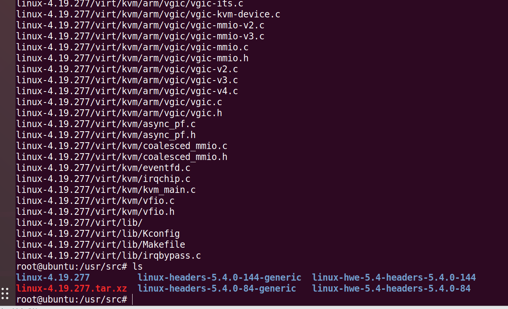
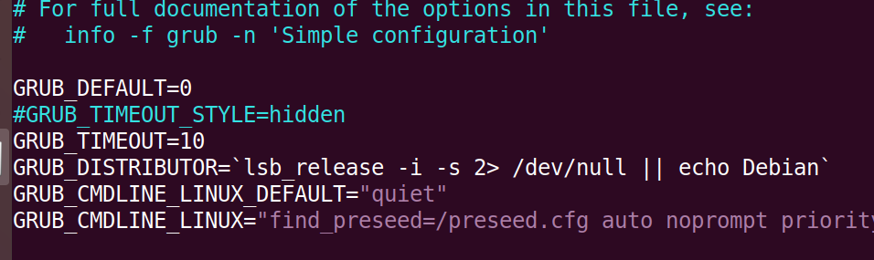
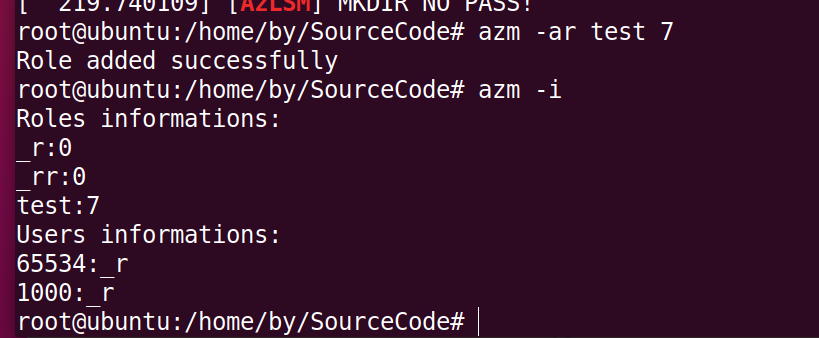

# 一、要求

实现一个LSM（Linux Security Module）安全模块，使得linux具备简单RBAC安全功能。

```
RBAC认为权限的过程可以抽象概括为：判断【Who是否可以对What进行How的访问操作（Operator）】这个逻辑表达式的值是否为True的求解过程。
```

- 用户可以承担角色；角色对应权限

# 二、知识准备

## 1. 了解什么是LSM

参考：

[LSM学习](https://ixyzero.com/blog/archives/3359.html)

```
LSM采用了通过在内核源代码中放置钩子的方法，来仲裁对内核内部对象进行的访问，这些对象有：任务，inode结点，打开的文件等等。用户进程执行系统调用（open system call），首先通过Linux内核原有的逻辑找到并分配资源（look up inode），进行错误检查（error checks），并经过经典的UNIX自主访问控制（DAC checks），「恰好」在Linux内核试图对内部对象进行访问之前，一个LSM的钩子（LSM hook）对安全模块所必须提供的函数进行一个调用，并对安全模块提出这样的问题”是否允许访问执行？”，安全模块根据其安全策略进行决策，作出回答：允许，或者拒绝进而返回一个错误。
```


总结：LSM提供了可以HOOK的函数，在这个函数中实现自己的检查，返回是否允许使用某操作。

Demo如下：

```c
#include <linux/lsm_hooks.h>
#include <linux/security.h>
#include <linux/module.h>
#include <linux/fs.h>
#include <linux/cred.h>
#include <linux/errno.h>
#include <linux/kernel.h>
#include <linux/init.h>

//是否通过
#define PASS 0
#define NOPASS EINVAL


int az_inode_mkdir(struct inode *dir, struct dentry *dentry,umode_t mode); //hook mkdir
int az_inode_rmdir(struct inode *dir, struct dentry *dentry);       //hook rmdir
int az_inode_rename(struct inode *old_dir, struct dentry *old_dentry,struct inode *new_dir,struct dentry *new_dentry);  //hook rename


/* 定义一个新的安全钩子 */
struct security_hook_list AzLSM_hook[] __lsm_ro_after_init = {
    LSM_HOOK_INIT(inode_mkdir, az_inode_mkdir),
    LSM_HOOK_INIT(inode_rmdir, az_inode_rmdir),
	LSM_HOOK_INIT(inode_rename, az_inode_rename),
};


void __init AzLSM_init(void)
{
    // 打印相关信息，通过dmesg查看 建议：dmesg | grep AzLSM
    pr_info("[AzLSM-info] : This is a security module with simple RBAC security functions, based on LSM \n");
    /* 注册Az的安全钩子 */
    security_add_hooks(AzLSM_hook, ARRAY_SIZE(AzLSM_hook), "AzLSM");   //添加安全模块函数
}

int az_inode_mkdir(struct inode *dir, struct dentry *dentry,umode_t mode)
{
    pr_info("[AzLSM] inode mkdir\n");
    return PASS;
}

int az_inode_rmdir(struct inode *dir, struct dentry *dentry)
{
    pr_info("[AzLSM] inode rmdir\n");
    return PASS;
}

int az_inode_rename(struct inode *old_dir, struct dentry *old_dentry,struct inode *new_dir,struct dentry *new_dentry)
{
    pr_info("[AzLSM] inode rename\n");
    return PASS;
}

security_initcall(AzLSM_init);

```

## 2. 接触简单的内核编程模块。

[小白学Linux之内核模块编程](https://blog.csdn.net/tigerjibo/article/details/6010997)

参考第一步Demo！！

## 3.下载Ubuntu内核

[Ubuntu下如何下载linux内核源码](https://blog.csdn.net/qq_42908042/article/details/97129502)

[如何在Ubuntu 22.04上安装Linux 内核 6.0？](https://zhuanlan.zhihu.com/p/583823240)

## 4. 环境配置

```
操作系统：Ubuntu 18.04
内存：8G
处理器：8
目标内核：4.19.277 # 此处避坑 参考后续总结避坑
uname -a # 查看内核版本信息
dmesg	# 查看内核输出信息
```

# 三、步骤

## 0. 前置 - 通用流程命令

通用流程，总结如下：

```
# 使用su
su

# 安装依赖
apt install build-essential dwarves python3 libncurses-dev flex bison libssl-dev bc libelf-dev zstd gnupg2 wget vim net-tools openssh-server -y

# https://kernel.org/ 在这里面下载合适的内核 本人使用 linux-4.19.277
wget https://cdn.kernel.org/pub/linux/kernel/v4.x/linux-4.19.277.tar.xz

# 移动到源码目录
mv linux-4.19.277.tar.xz /usr/src/

# 解压
tar xvf 4.19.277.tar.xz

# 进入目录
cd linux-4.19.277

make mrproper # 清除十分彻底
cd security
# 是把自己的模块写入内核
cp -r /home/by/azlsm ./
vim Makefile
vim Kconfig

make menuconfig # 取消其他模块，只留我们的

vim .config

CONFIG_SYSTEM_TRUSTED_KEYS # 将该项原有内容删掉即可，如下
CONFIG_SYSTEM_TRUSTED_KEYS=""

CONFIG_SYSTEM_REVOCATION_KEYS="" # 修改CONFIG_SYSTEM_REVOCATION_KEYS（可选）

cd .. # 在linux-4.1... 目录下

make -j16 
make modules_install -j16
make install -j16
vim /etc/default/grub
# GRUB_TIMEOUT_STYLE=true 注销掉
GRUB_TIMEOUT=10
update-grub
reboot

uname -a # 查看内核版本信息
dmesg	# 查看内核输出信息
```

## 1. 安装虚拟机

虚拟机环境：18.04

**首先更新虚拟机源**

```
su
apt update && apt upgrade -y

# 安装依赖
apt install build-essential dwarves python3 libncurses-dev flex bison libssl-dev bc libelf-dev zstd gnupg2 wget vim net-tools openssh-server -y
```


## 2. 下载内核，配置内核

去[kernel.org](https://kernel.org/)下载linux内核源码


传入虚拟机中，解压



进入linux内核文件夹，然后清除已编译的东西

```
make mrproper	#取消代码树
make clean
```


然后将自己的安全模块加入到内核文件中，将我的azlsm文件夹copy到security下，然后修改Makefile、Kconfig文件，文件增加如下：

Makefile：

```
subdir-$(CONFIG_SECURITY_AZLSM)		+= azlsm

obj-$(CONFIG_SECURITY_AZLSM)		+= azlsm/
```

Kconfig

```
source security/azlsm/Kconfig

default DEFAULT_SECURITY_AZLSM if SECURITY_AZLSM

	config DEFAULT_SECURITY_AZLSM
		bool "azlsm" if SECURITY_AZLSM=y

default "azlsm" if DEFAULT_SECURITY_AZLSM
```

主要目的是为了添加上我的安全模块AzLSM。

当然，在azlsm文件下，也有M、K文件，其内容如下：

Makefile：

```
obj-$(CONFIG_SECURITY_AZLSM) := az.o
az-y := azlsm.o
```

Kconfig：

```
config     SECURITY_AZLSM
   bool     "azlsm support"
   depends on SECURITY
   default     n
   help
        introduction of azlsm
```


接下来，我们就将自己的安全模块选中，取消其他安全模块

```
make menuconfig
```


查看默认安全模块：


保存！！


修改配置文件，使其内核不需要签名验证

```
vim .config
```


将“”内容删除，保存

## 3. 编译内核和模块

可以采用一键式

```
make -j8 # 8 代表8个并行线程
```

等待20分钟(取决于电脑)左右，编译完成后，可以拍个快照，这样如果后续内核崩溃，可以返回该快照。


## 4. 安装内核和模块

```
make modules_install -j16
make install
```


使用make install无需手动生成镜像：mkinitramfs

因为我们内核是降级的，所以需要修改启动项，让我们自己选择内核。

```
vim /etc/default/grub
```

修改如下：

```
# GRUB_TIMEOUT_STYLE=true
GRUB_TIMEOUT=10
# 开启菜单显示
此配置将影响grub菜单显示。若设置此选项为一个常数，则将在此时间内隐藏菜单而显示引导画面。菜单将会被隐藏，如果注释掉该行，即：(#GRUB_HIDDEN_TIMEOUT=0)。则grub菜单能够显示，等待用户的选择，以决定进入哪个系统或内核。
```



更新

```
update-grub
```


## 5. 功能模块启动前的最终准备

首先，我们不能在启动的时候启用模块，因为很多文件操作在启动的时候，所以默认应该是关闭的，那么我们就需要将配置文件设置为未启用！

```
mkdir /etc/azlsm/
cd /home/by/Sourcecode/
make
./azm
./azm -i
./azm -s disa
```


## 6. 重启验证

```
reboot
```

选择我们的4内核


然后查看内核消息

```
dmesg | grep "AzLSM"
```


发现未启用，我们通过用户层管理程序将其启用！


验证，使用by用户，创建文件


没有权限，那我们考虑新建一个角色，其实具有全部权限



将by的角色设置为test


再次测试创建删除文件


发现，已经可以！！

# 四、功能模块

## 1. 策略文件

| 路径                  | 文件格式  | 说明                                   |
| --------------------- | --------- | -------------------------------------- |
| /etc/azlsm/azconfig   | 1 or 0    | 1表示开 0表示关                        |
| /etc/azlsm/roleconfig | perm:role | 7:_r perm是数字,表示权限，role是字符串 |
| /etc/azlsm/userconfig | uid:role  | 1000:_r uid是数字，role是字符串        |

以二进制模式写入的！

## 2. 模块参数

| 参数         | 作用               | 备注 |
| ------------ | ------------------ | ---- |
| `-s`         | 查看AzLSM启动状态  |      |
| `-s enable`  | 使AzLSM生效        |      |
| `-s disable` | 禁用AzLSM          |      |
| `-i`         | 显示用户、角色信息 |      |
| `-i users`   | 显示用户信息       |      |
| `-i roles`   | 显示角色信息       |      |
| `--help`     | 显示帮助信息       |      |
| `-ar`        | 增加角色           |      |
| `-dr`        | 删除角色           |      |
| `-cr`        | 改变角色           |      |
| `-cur`       | 改变用户角色       |      |


# 五、代码解释

## 1.用户管理层

基本思路是通过配置文件管理，共三个配置文件。

```C
// 控制开关
#define STATE_PATH  "/etc/azlsm/azconfig"     // 1 or 0

//角色信息 如某个角色具有什么权限 如 7:test 就是test角色具有 111权限
#define ROLES_PATH  "/etc/azlsm/roleconfig"   // test:1

// 用户信息 如某个用户对应哪个角色 如 1000:test 就是uid1000的用户是test角色
#define USERS_PATH  "/etc/azlsm/userconfig"    // 
```

整体管理层就是对文件的操作，函数如下

```C

// 函数声明
void ShowHelp();            //功能列表 help 信息
void ShowALLInfo();         //显示用户、角色信息
void ShowInfo(int a);       //显示用户信息
int GetState();             //得到AzLSM启用状态
int SetState(int op);      //设置更改AzLSM状态
int AddRole(const char *role, int permission); //增加角色
int DelRole(const char *role);  //删除角色
int ChangeRole(const char *role, int permission); //改变角色
int ExitRole(const char *role); //判断角色是否存在
int ChangeUserRole(int userid,const char *role);// 更改用户角色

// 初始化
void Init(); //初始化生成配置文件
void Init_S();
void Init_U();
void Init_R();
```

azm可以通过命令行传参，典型demo如下：

```C
//printf("%d\n",__LINE__);
    // 显示用户、角色信息
    if(!strcmp (argv[1], "-i"))
    {
        if (argc == 2)
        {
            ShowALLInfo ();
            return 0;
        }

        if (!strcmp (argv[2],"users"))
        {
            ShowInfo (2);
            return 0;
        }

        if (!strcmp (argv[2],"roles"))
        {
            ShowInfo (1);
            return 0;
        }

        printf ("Error: unknow argument after -info\n");
        return 0;
    }

```

文件操作典型Demo如下：

```c
int AddRole(const char *role, int permission)
{
    if (ExitRole (role) == 0)
    {
        char separator =":";
        FILE *fpr ;
        fpr = fopen(ROLES_PATH,"ab");
        if (fpr == NULL)
        {
            printf("Error opening file. %s\n",ROLES_PATH);
            return ;
        }
        fwrite(&permission, sizeof(permission) , 1 ,fpr);
        fwrite(":", sizeof(char), 1, fpr);
        fwrite(role, sizeof(char), strlen(role), fpr);
        fwrite("\n", sizeof(char), 1, fpr);
        fclose(fpr);
        return 1;
    }
    printf("Role already exists in configuration file.\n");
    return 0;
}
```

## 2. 内核层

因为内核层无法使用C标准库的函数，所以只能使用内核函数。其主要也是对文件的操作。

内核层的结构Demo参考**知识准备**部分。

函数如下：

```C
int az_inode_mkdir(struct inode *dir, struct dentry *dentry,umode_t mode); //hook mkdir
int az_inode_rmdir(struct inode *dir, struct dentry *dentry);       //hook rmdir
int az_inode_rename(struct inode *old_dir, struct dentry *old_dentry,struct inode *new_dir,struct dentry *new_dentry);  //hook rename
int GetEnable(void); // 得到AzLSM启动状态
int GetPerm(int uid); //  得到当前用户角色的权限
int GetUseruid(void); //得到当前用户uid
```

典型钩子函数内部判断如下：

```C
int az_inode_mkdir(struct inode *dir, struct dentry *dentry,umode_t mode)
{
    int user_uid;
    int user_perm ;
    user_uid =  GetUseruid();
    //pr_info("[AzLSM-test] : mkdir op ! uid = %d \n ", user_uid);
    if (GetEnable() == Disabl)
        return PASS ;
    
    pr_info("[AzLSM] : State is enable!\n");

    user_perm = GetPerm(user_uid);

    if (user_perm == EINVAL || user_perm == ERR)
    {
        pr_info("[AzLSM-test] GetPerm failed!  return PASS \n");
        return PASS;
    }
    pr_info("[AzLSM] Current user permission : %s \n",Permission_List[user_perm]);
    //PrintPerm(user_perm);

    if ( (user_perm & SYSCALL_MKDIR ) != 0)
    {
        pr_info("[AzLSM] MKDIR PASS!\n");
        return PASS;
    }

    pr_info("[AzLSM] MKDIR NO PASS!\n");
    // return PASS ;
    return NOPASS;
}
```

思路为，获得 Uid -> role -> perm 最后判断是否放行。

内核层文件操作Demo如下

```c
int GetEnable(void)
{
    int user_uid;
    user_uid =  GetUseruid();

    if (user_uid < 1000)
    {
        return Disabl;
    }

    struct file *fout = filp_open (STATE_PATH, O_RDONLY, 0) ;
	char state_buf[sizeof(int)] ;
	int state ;
	mm_segment_t fs ;


    //pr_info("[AzLSM-test] : GetEnable uid = %d , line = 177 \n",user_uid);


	if (!fout || IS_ERR(fout))
	{
		pr_info ("[AzLSM] : [GetState] load file error. please check %s\n ",STATE_PATH) ;
		return Disabl ;
	}
	
	fs = get_fs () ;
	set_fs (KERNEL_DS) ;
	
	vfs_read(fout, state_buf, sizeof(int), &fout->f_pos) ;
	memcpy (&state, state_buf, sizeof(int)) ;
	
	set_fs (fs) ;
	filp_close (fout, NULL) ;

    if(state < 0)
    {
        pr_info("[AzLSM] GetState: State error !! State = %d\n" ,state) ;
    }
    
    pr_info("[AzLSM] GetState : %d  uid : %d\n",state, user_uid);

    if (state == 1)
    {
        //pr_info("[AzLSM-test] GetEnable return enable !! \n");
        return Enabl;
    }

    return Disabl ;
}
```

# 六、避坑

```
1.hook点只能从security_list_options里面选，我参考的一根稻草大佬的博客里选取的是task_create，但是这个函数在4.19.163中不能用做hook点。

2.自己补充实现的函数，其定义必须与hook点的函数一模一样，包括返回值和参数。

3.可以先编译一遍模块和内核，下次编译的时候会加速

4.将输出重定向到文件，固然可以方便事后查看一些信息，但是会造成编译时间成倍增加。

5.注意默认模块要禁用，不然无法开机

6.重新编译后直接重启，不需要再修改grub。

7.不要使用5的内核，其中的security_initcall(AzLSM_init)会报错，且函数的参数也变化了！

8.配置不好不要开多线程。

9.注意快照
```

# 七、参考

https://github.com/jmhIcoding/RBOS

https://github.com/guomo233/LSM-based-RBAC

https://blog.csdn.net/jmh1996/article/details/88935907

https://blog.csdn.net/clh14281055/article/details/112254984

https://ixyzero.com/blog/archives/3359.html

https://github.com/L1B0/LSM-demo

https://onestraw.github.io/linux/lsm-example/

https://zhuanlan.zhihu.com/p/583823240

https://git.kernel.org/pub/scm/linux/kernel/git/torvalds/linux.git/

https://www.jianshu.com/p/9a640329449b

https://rlyown.github.io/2021/07/14/LSM%E5%AE%89%E5%85%A8%E6%A8%A1%E5%9D%97%E5%BC%80%E5%8F%91/

https://blog.csdn.net/huzai9527/article/details/119870485

https://blog.csdn.net/WSRspirit/article/details/66972515
